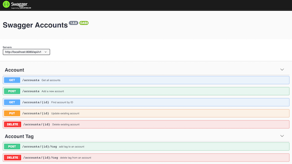
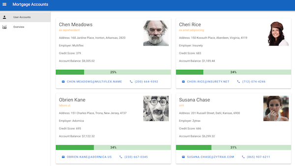
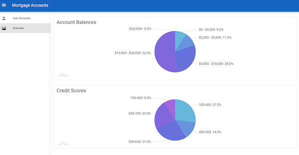

## Full Stack Challenge
A dashboard with two pages and an accompanying API

* Database: Postgres 12
* Backend: Node API with Express using TypeScript
* FrontEnd: Vue.js

### Run the Application Stack using Docker Compose

Build Api 

```
$ cd ./api
$ npm install --dev 
$ npm run build
```

Build Webapp

```
$ cd ./client
$ npm install --dev 
$ npm run build
```

Create environment variables file `.env` in the root directory of the repository :
```bash
DB_PORT=5432
DB_ROOT_USER=root
DB_ROOT_PASSWORD=secret
DB_USER=app_user
DB_PASSWORD=password
DB_NAME=app_db
```

Run docker-compose to start all the applications

```
docker-compose up --build [-d]
```

Optional: Use -d option to run the containers in background.


Swagger API Doc: http://localhost:8080/


WebApp: http://localhost:8081/accounts


WebApp: http://localhost:8081/overview



### Development Environment

1. Start Postgres Database Container:

```
$ cd ./db
$ docker-compose up --build
```


2. Start development server for API

```
$ cd ./api
$ npm run dev
```
This should already add the seed data to the database.


3. Start the Web Application development server

```
$ cd ./client
$ yarn serve
```

